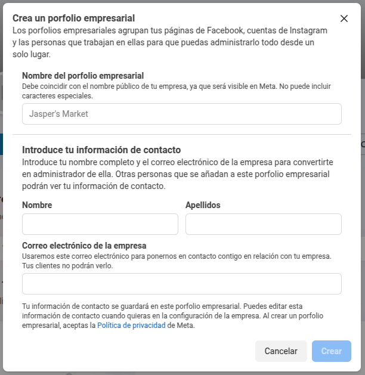
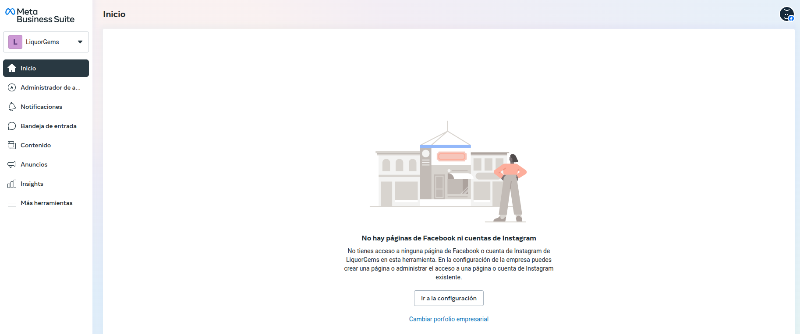
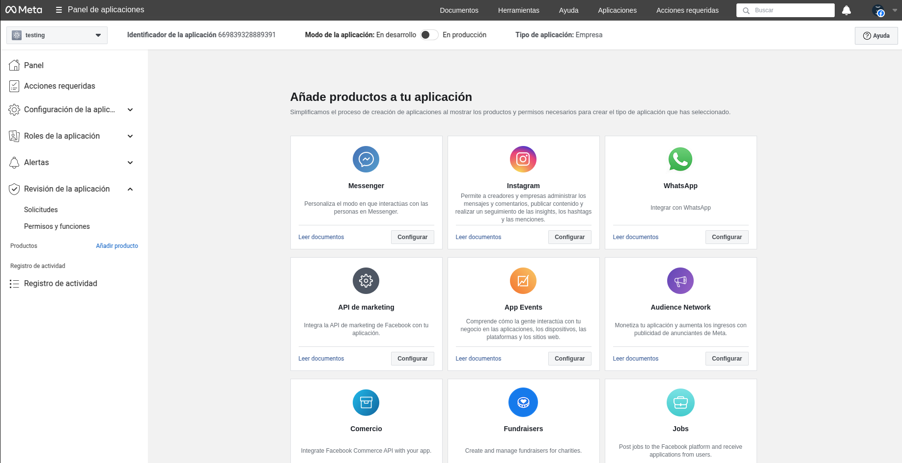
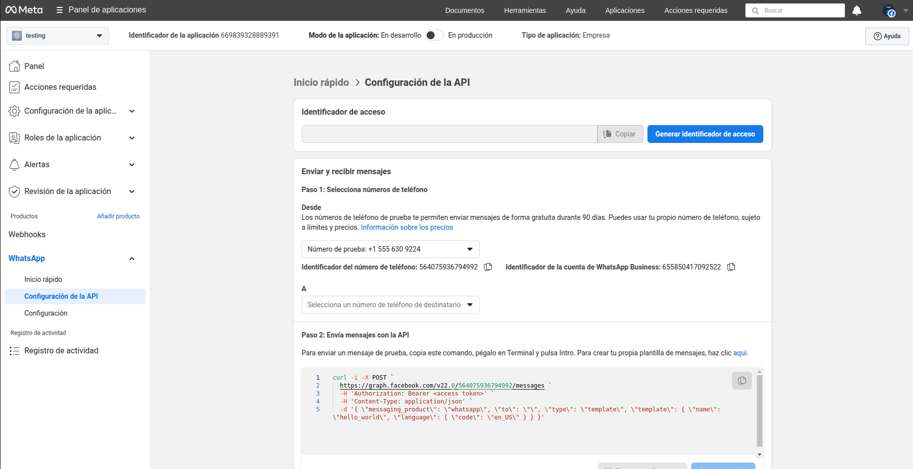
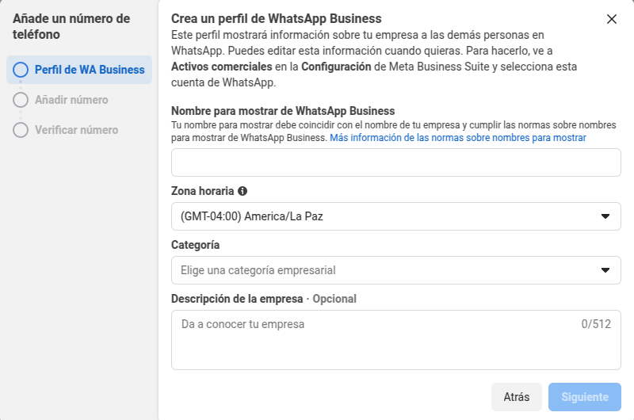

# WhatsApp App

Este proyecto es un demo de cómo configurar y enviar mensajes utilizando la API de WhatsApp del proveedor **Meta**.

## Requisitos

Antes de comenzar, asegúrese de tener instaladas las siguientes herramientas:

- **Java 21.0.2 GraacVM CE** (se recomienda esta versión para la compilación en nativo)
   - **Nota adicional:** se hizo pruebas con Java 17.0.9 GraalVM CE, pero no se logró la compilación en nativo.
- **Apache Maven** (Para gestionar dependencias y compilar el proyecto)
- **Quarkus** (Framework utilizado en este proyecto)

### Cuenta en Meta for Developers

Para crear una cuenta en Meta for developers se debe seguir los siguientes pasos:
1. Creación de cuenta personal de facebook.
2. Iniciar sesión con la cuenta personal en [Meta Developer Portal](https://developers.facebook.com/async/registration).
   - **Nota**: Revisar los terminos y condiciones de la plataforma de Meta.
3. Se verificará la cuenta mediante correo o mensaje al número de teléfono registrado.

Para mas información: https://developers.facebook.com/docs/development/register


### Creación de un portfolio empresarial en Facebook
1. Con la cuenta personal se debe iniciar sesión en [Meta Business Suite](https://business.facebook.com/).
2. Al hacer click en el apartado `Crea un portfolio empresarial` debe hacer el llenado de los siguientes campos: 

3. Se pedirán datos extras como el registro de correos de empleados, o vinculación de páginas de facebook al portfolio empresarial.
4. Si el proceso se completa de forma adecuada, debería poder verse el panel de control de Meta business Suite.


Para más información: https://www.facebook.com/business/help/1710077379203657


### Creación de una aplicación en Meta Developer
1. Iniciar sesión en [Meta Business Suite](https://business.facebook.com/).
2. Presionar el botón de `Crear Aplicación`.
3. Se pedirá datos como: Nombre de la aplicación y correo electrónico de contacto de la aplicación.
4. Se pedirá añadir un caso de uso para la aplicación, seleccione `Otro`.
5. Se pedirá seleccionar un tipo de aplicación, seleccione `Negocios` para el uso de whatsapp api.
6. Se mostrará un panel de detalles de la aplicación, seleccione el portfolio empresarial anteriormente creado.
7. Al final del proceso debería mostrarse el panel de control de la aplicación, añada `Whatsapp`.



Para más información: https://developers.facebook.com/docs/development/create-an-app/
### Uso de la api de Whatsapp
1. En la barra lateral del panel de control de la aplicación anteriormente creada habrá un listado de los productos añadidos, haga click en la opción de whatsapp.

2. Generar un token presionando en el botón `Generar identificador de acceso`.
3. Se puede registrar un número telefónico desde el que enviarán los mensajes
  - Se pedirá el registro del Perfil de Whatsapp Business
  
  - Dicho número no debe estar vinculado anteriormente a una cuenta de whatsapp.
4. Se pedirá el registro de un número destino al cual enviar mensajes, hasta 5 destinatarios se permite el uso gratuito de la api, luego se debe registrar un medio de pago.

- **Nota**: Adicionalmente se puede hacer el uso de webhooks para recibir notificaciones de cuando se reciba un mensaje.

## Configuración del Proyecto

### Clonar el Repositorio
```sh
 git clone https://github.com/tuusuario/whatsapp-app.git
 cd whatsapp-app
```

### 2️Configurar apĺication.properties

```env
ACCESS_TOKEN=EAAJlebb0VCoBO...   # Access Token de la API de Meta
```

### Enviar Mensaje de WhatsApp

Para enviar un mensaje, usa la siguiente API REST:

- **Endpoint:** `POST /api/whatsapp/message`
- **Headers:**
  - `Content-Type: application/json`
- **Body:**
```json
{
  "to": "591XXXXXXXXX",
  "date": "2025-03-11",
  "time": "15:30"
}
```

Como ejemplo, se utilizó una plantilla creada para el envío de notificaciones de visitas programadas, por lo que se mandan los parámetros: número destino, fecha y hora de la visita programada.

## Compilación en Modo Nativo
Si deseas ejecutar la aplicación en modo nativo con **GraalVM**, 
   - **Nota:** En mi caso particular, requerí de la instalación de `zlib` para la ejecución en modo nativo.
    ```sh
        sudo apt update
        sudo apt install -y zlib1g-dev
    ```
Para la compilación nativa:
```sh
mvn package -Pnative
```
Esto generará un binario en `target/whatsapp-app-1.0.0-SNAPSHOT-runner`.


## Correr la aplicación en modo Dev

Para correr la aplicación en modo desarrollador, utilice el siguiente comando:

```shell script
./mvnw quarkus:dev
```
